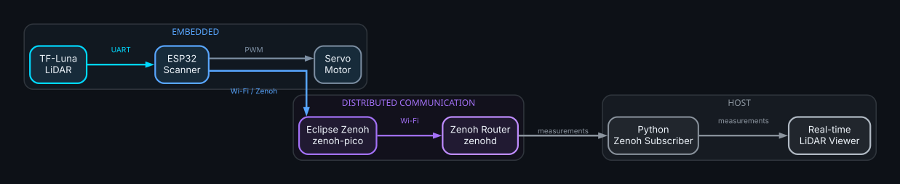

# System Architecture

## Overview

The TF-Luna Zenoh Scanner is a distributed LiDAR scanning system composed of an ESP32-based embedded device and a host PC.

The ESP32 interfaces with the TF-Luna LiDAR through UART, controls a servo motor to perform an angular scan, and publishes measurements over Wi-Fi using Eclipse Zenoh.

A Zenoh router provides the communication infrastructure between the embedded device and the host PC.

The host application subscribes to the measurements and provides a real-time visualization of the scan.

## System Architecture

## Components

### ESP32

The ESP32 is responsible for the embedded part of the system.

Its main responsibilities are:

- TF-Luna communication
- Servo control
- LiDAR scanning
- Measurement generation
- Zenoh communication
- Wi-Fi connectivity

The embedded software is divided into independent modules to keep hardware drivers, scanning logic and network communication separated.

### TF-Luna Driver

The TF-Luna driver handles communication with the sensor through UART.

Responsibilities include:

- Receiving sensor frames
- Validating frames
- Checking checksums
- Parsing measurements
- Handling communication errors

The driver must not contain scanner or Zenoh logic.

### Servo Controller

The servo controller generates the PWM signal required to position the sensor.

Its responsibilities include:

- Servo initialization
- Angle positioning
- PWM generation
- Position limits

The servo controller is independent from the LiDAR driver.

### Scanner

The scanner coordinates the TF-Luna and servo controller.

Its responsibilities include:

- Defining the scanning range
- Moving the servo
- Waiting for servo stabilization
- Requesting LiDAR measurements
- Associating measurements with scan angles
- Generating scan measurements

### Zenoh Publisher

The Zenoh publisher transmits scanner measurements from the ESP32 to the Zenoh router.

Network communication must remain independent from the scanner logic.

Temporary network failures must not permanently block the scanner.

### Zenoh Router

The Zenoh router provides the communication infrastructure between the ESP32 and the host PC.

The router is intended to run on the host machine using Docker.

### Host Application

The host application receives measurements from Zenoh and provides real-time visualization.

It is divided conceptually into:

- Zenoh subscriber
- Measurement parser
- Visualization

The subscriber must remain independent from the visualization layer.

## Data Flow

The main data flow is:

    TF-Luna
        ↓
    UART
        ↓
    ESP32 TF-Luna Driver
        ↓
    Scanner
        ↓
    Measurement
        ↓
    Zenoh Publisher
        ↓
    Wi-Fi
        ↓
    Zenoh Router
        ↓
    Zenoh Subscriber
        ↓
    Visualization

## Design Principles

The architecture follows these principles:

### Separation of concerns

Each module should have a clearly defined responsibility.

### Low coupling

Hardware drivers, scanner logic and network communication should remain independent.

### Reproducibility

Host-side infrastructure should use Docker where it provides a meaningful reproducibility benefit.

### Fault tolerance

Temporary sensor or network failures should not cause the entire application to become permanently blocked.

### Extensibility

The architecture should allow additional sensors, visualization methods and communication interfaces to be introduced without rewriting the core scanner logic.

## Repository Mapping

| Component | Repository location |
|---|---|
| ESP32 firmware | `firmware/` |
| Host application | `host/` |
| Hardware documentation | `hardware/` |
| Architecture and documentation | `docs/` |
| GitHub configuration | `.github/` |
